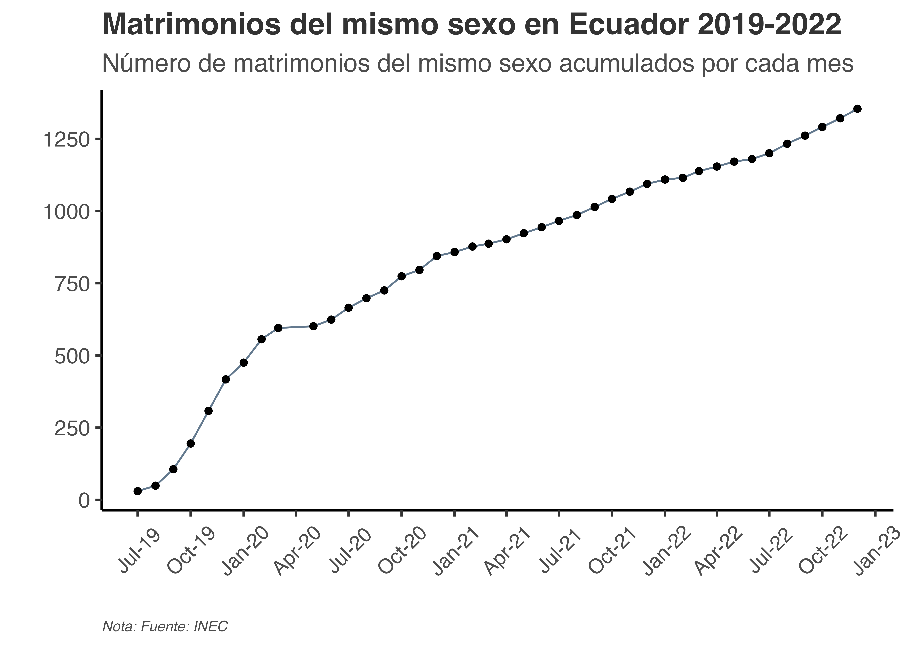

```{r setup, include = FALSE}
# Opciones de chunks
knitr::opts_chunk$set(echo = F)
```

# El matrimonio igualitario

El contraer matrimonio entre dos personas de cualquier sexo es uno de los derechos más básicos para la adecuada integración de las personas homosexuales a la sociedad civil. Sin embargo, en Ecuador solamente desde el 12 de Junio del 2019 se permitió el matrimonio igualitario, años después de que dos parejas LGBTQ+ intentaran, sin éxito, casarse en un Registro Civil [@castro_2019]. La encuesta del Barómetro de las Américas (AB), ya utilizada en anteriores artículos del blog, nos permite evaluar la evolución de la opinión pública sobre el matrimonio igualitario en el Ecuador, como se ve a continuación.

```{r}
knitr::include_graphics('figures/grafico2_lapop_pride.png')
```

Ventajosamente, el Ecuador ha observado un creciente apoyo a este derecho: entre el 2010 y 2019 el apoyo al matrimonio entre personas del mismo sexo se dobló: un aumento de 18.34 puntos porcentuales. Sin embargo, es notable el cambio entre 2012 y 2014, en donde se observa una reducción del apoyo en más de 10 puntos porcentuales. Si bien no podemos asegurar una razón definitiva para esta reducción, es muy probable que, tras el intento fallido de matrimonio entre las activistas Pamela Troya y Gabriela Correa en 2013, la discusión aumentó en gran medida. De hecho, el primer mandatario del país en el momento, el conservador de izquierda Rafael Correa, reiteró su desaprobación del matrimonio igualitario en 2013 así como del cambio de sexo en la cédula de identidad y el derecho de adopción de parejas del mismo sexo, en apoyo a "la familia tradicional" [@El_Universo_2013]. 

Ante una denuncia presentada por Troya y Correa, una jueza negó el recurso, reconociendo que en la Constitución del Ecuador del 2008 se contempla el matrimonio entre un hombre y una mujer solamente, así como reconoció la "invocación de Dios en la Constitución" y que "no hay constitución sin valores ni principios", aun cuando el Ecuador es un estado laico [@alarcon_2018, @planv_2016]. El matrimonio igualitario sería aprobado tras un largo proceso después una denuncia presentada por Efraín Soria y Javier Benalcázar, a quiénes también se les negó su intento de casarse en 2018. 

Teniendo a figuras de autoridad que atacaron al matrimonio igualitario, sería entendible observar una considerable reducción como la observada en la aprobación del matrimonio igualitario. No podemos analizar el efecto de la aprobación del matrimonio igualitario en la opinión pública, puesto que la aprobación se dio en junio y las encuestas finalizaron en febrero del 2019. Sin embargo, observamos que entre 2012 y 2016 se tuvo una considerable recuperación en el porcentaje de aprobación y una diferencia no estadísticamente significativa entre 2016 y 2019. Una vez más, es complicado conocer las razones de este aumento, pero existe la posibilidad que la legalización de la unión de hecho entre personas del mismo sexo en 2014, la aprobación del matrimonio igualitario de algunas figuras cercanas al gobierno, y una opinión de la Corte Interamericana de Derechos Humanos hayan influenciado positivamente la aprobación de este derecho en la población. 

¿Que ha sucedido desde la legalización del matrimonio igualitario? Utilizamos datos del INEC/Registro Civil para calcular el número de matrimonios del mismo sexo desde su legalización. A continuación ilustramos los resultados desde julio 2019 hasta diciembre 2022.

```{r}

```

El gráfico muestra la distribución acumulada del número de matrimonios desde julio del 2019. El incremento más empinado ocurre en la segunda mitad del 2019, inmediatamente después de la legalización del matrimonio igualitario. Este fenómeno es entendible, considerando que muchas parejas esperaron por este momento para contraer matrimonio. Tras una parada en seco debido al confinamiento por el COVID-19 en abril 2020, se evidencia la normalización de los matrimonios del mismo sexo, quizás llegando a su tendencia normal. En cualquier caso, los matrimonios del mismo sexo siguen representando una proporción pequeña del total de matrimonios. El estudio de este fenómeno es complicado debido a la dificultad de obtener autoidentificación de orientación sexual en encuestas, sin embargo, algunos factores económico/laborales podrían disuadir a parejas homosexuales para casarse^[Brown (1998) demuestra las diferencias de ingresos entre parejas homosexuales y heterosexuales, en donde las últimas ganan más [@Brown_1998]. Contraer matrimonio podría acentuar la discriminación si la pareja ha mantenido en secreto su relación.]

# El derecho a la participación política

Más allá del matrimonio igualitario, la encuesta también consulta a los ciudadanos sobre su aprobación a los derechos políticos de las personas homosexuales. Específicamente, pregunta el grado de aprobación del derecho de las personas homosexuales de postularse a cargos políticos. A continuación mostramos los resultados.

```{r}
knitr::include_graphics('figures/grafico1_lapop_pride.png')
```

Existe un constante aumento en la aprobación del derecho a postularse a cargos políticos de las personas homosexuales, superando el 40% de aprobación. Sin embargo, con más de un 50% de desaprobación, las posibilidades electorales de postulantes homosexuales están automáticamente en desventaja. 

No es un secreto que la clase política ecuatoriana es conservadora, indiferente de su posición frente a la economía de mercado. El régimen que gobernó al país desde 2006 hasta 2017 tuvo muchos episodios donde sus rasgos conservadores se evidenciaron: además del rechazo al matrimonio igualitario, se rechazó la legalización del aborto, la "ideología de género" y se propuso un plan nacional que reemplace a los centros de salud por la familia en la educación sexual [@ad]. Por otro lado, los dos últimos gobiernos con tendencia a la derecha no motivaron las libertades sociales, vetando proyectos de ley que despenalizaban el aborto y abogando por menos inclusión en la educación^[El vicepresidente Otto Sonnenholzner en 2019, ante la legalización del matrimonio igualitario, menciona que defenderá "con uñas y garras mi derecho de educar a mis hijos como yo pienso"^ [@reuters].] [@infobae2020; @lasso; @reuters].

El electorado ecuatoriano es, en general, igualmente conservador. Los resultados de la encuesta presente determinaron que, si bien los valores progresistas han aumentado con el tiempo en el país, siguen estando muy arraigados, especialmente en torno al rechazo a las personas homosexuales y los servicios públicos para personas extranjeras. Las encuestas también revelan que no existe una relación clara entre la tendencia política y el conservadurismo, ya que el país, si bien se encuentra en el ala conservadora de la región, se sitúa en el centro de la dicotomía política izquierda y derecha [@Moncagatta.2020]. De hecho, la autoidentificación política tampoco responde a los tradicionales valores e ideas económicas y sociales de estas tendencias políticas, por lo que se ha propuesto que la identificación política quizás responde más a personajes políticos [@hbc].

En conclusión, la verdad desnuda, pero sin desmanes ni burlas^[Véase [lo mencionado](https://www.eluniverso.com/noticias/informes/no-desmanes-no-desnudos-ni-burlas-dijo-el-alcalde-aquiles-alvarez-tras-acuerdo-con-colectivo-lgbtiq-para-que-lmarcha-del-orgullo-se-realice-en-el-centro-de-guayaquil-nota/) por el alcalde de Guayaquil, Aquiles Álvarez después de acceder al desfile de orgullo LGBTIQ+ que inicialmente desautorizó.], es que al Ecuador aun le queda mucho por recorrer en términos de la inclusión social, civil y política de las personas homosexuales. Aunque existen excepciones, como el caso del primer alcalde electo que es abiertamente gay [@alcalde], la opinión pública así como las instituciones políticas y civiles aun son altamente heteronormativas. Sin embargo, juzgando por el constante crecimiento de la aprobación de los derechos de personas homosexuales, se puede tener una perspectiva optimista por lo que le espera al país en términos de inclusión, aun más considerando que son las personas más jóvenes las que comienzan a adoptar valores socialmente progresistas [@Moncagatta.2020].

# Notas Metodológicas

1. La encuesta Barómetro de las Américas (AB) implementada por el Latin American Public Opinion Project (LAPOP) ha preguntado a la población en edad de votar (16+ años) sobre varios temas de opinión pública. Las encuestas se realizan en Ecuador desde el 2004, sin embargo, las preguntas analizadas aquí solo se empezaron a realizar desde 2010 y 2006, respectivamente. 

2. Ambas preguntas del AB que se utilizan aquí se preguntaron en términos de una escala del 1 al 10, en donde 1 es máximo rechazo y 10 es máximo apoyo. Los gráficos representan el porcentaje de personas en edad de votar que indicaron respuestas de 6 al 10.

# Referencias
